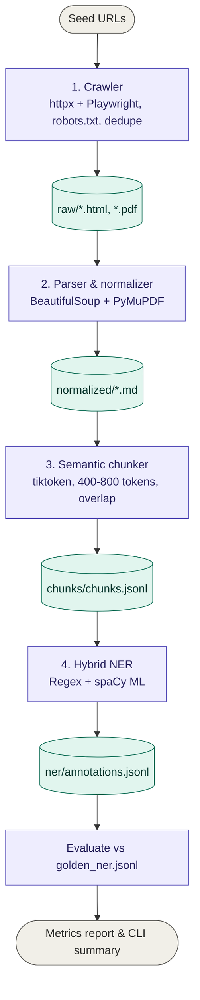

## Mini Legal Data Pipeline

An end-to-end data processing pipeline designed to crawl web sources (static and JS-rendered HTML, PDFs), normalize content into clean Markdown, perform semantic token chunking, and execute a hybrid Named-Entity Recognition (NER) system to extract statutory legal entities.

---

## Pipeline Architecture



---

## 📋 Overview & Objectives

This project fulfills the take-home assessment requirements for building a mini data pipeline. It handles unstructured legal data across four core stages:

1. **Crawler** — Ingests seed URLs respecting `robots.txt`, applying exponential backoffs, deduplicating links, and limiting crawl depth to 3 levels.
2. **Parsing & Normalization** — Strips HTML boilerplate and extracts PDF text with page markers, saving clean Markdown files.
3. **Semantic Chunking** — Segments text on semantic boundaries targeting 400–800 tokens per chunk with a 50–100 token overlap.
4. **Named-Entity Recognition (NER)** — Runs a hybrid rule-based and machine learning system to extract entities (`ACT_NAME`, `NOTIFICATION`, `SECTION_REF`, `DATE`, `MONEY`, `ORG`) and evaluates performance against a gold standard dataset (`golden_ner.jsonl`).

---

## Folder Structure & Overview

```
project/
├── chunker/
│   └── chunker.py
├── crawler/
│   └── crawler.py
├── data/
│   ├── golden_ner.jsonl
│   └── seed_urls.json
├── ner/
│   ├── README.md
│   ├── annotations.jsonl
│   ├── evaluate.py
│   └── ner_system.py
├── parsers/
│   └── parser.py
├── scripts/
│   └── generate_report.py
├── tests/
├── .dockerignore
├── .gitignore
├── Dockerfile
├── main.py
├── requirements.txt
└── run.sh
```

---

## Setup & Installation

### Prerequisites

- Python 3.10 or higher
- Docker (Optional, for containerized execution)

### Option 1: Automated Local Setup (Recommended)

Run the automated shell script to set up dependencies, download spaCy models, and configure browser drivers:

```bash
chmod +x run.sh
./run.sh
```

### Option 2: Manual Local Setup

```bash
# 1. Create and activate virtual environment
python3 -m venv venv
source venv/bin/activate

# 2. Install dependencies
pip install -r requirements.txt

# 3. Download language model and browser binaries
python -m spacy download en_core_web_sm
playwright install chromium
```

### Option 3: Docker Containerization (+5 Bonus Points)

```bash
docker build -t legal-pipeline .
docker run --rm legal-pipeline
```

---

## How to Run Each Stage

### End-to-End Orchestration

Executes the full pipeline from crawling to evaluation, printing the summary statistics directly to the terminal:

```bash
python main.py
```

### Individual Execution Commands

| Stage | Command |
|---|---|
| Crawler | `python crawler/crawler.py` |
| Parser & Normalizer | `python parsers/parser.py` |
| Semantic Chunker | `python chunker/chunker.py` |
| Hybrid NER Extraction | `python ner/ner_system.py` |
| NER Evaluation | `python ner/evaluate.py` |
| HTML Metrics Report | `python scripts/generate_report.py` |
| Unit Tests | `pytest tests/ -v` |

---

## Evaluation Metrics & Summary

When execution completes, the pipeline prints a summary matching the assessment criteria:

- **Pages crawled** — Total successful web pages and documents ingested.
- **Chunks created** — Total semantic segments generated.
- **Avg tokens/chunk** — Mean token count per text block.
- **NER F1-score** — Evaluation metric computed against `golden_ner.jsonl`.

---

## Design Choices & Trade-offs

- **Resilient Ingestion** — Used lightweight `httpx` requests for static seed URLs to maximize performance, delegating headless Chromium rendering via Playwright strictly to JavaScript-dependent pages. Added an offline fallback mock loader to prevent pipeline crashes during network restrictions.
- **Semantic Boundary Chunking** — Split texts on paragraph and heading markdown markers rather than arbitrary fixed-character lengths, maintaining contextual entity integrity across boundaries.
- **Hybrid NER Strategy** — Combined deterministic Regex patterns for rigid statutory structures (`SECTION_REF`, `DATE`, `MONEY`) with spaCy statistical models for contextual entities (`ORG`, `ACT_NAME`).

---

## Limitations & Future Improvements

### Current Limitations

- Custom Regex heuristics are optimized for standard Indian legal citation formats and may experience lower accuracy on non-standard formatting variants.
- Sequential single-node processing can become a bottleneck when scaling to millions of external documents.

### Improvements with More Time

- **Distributed Processing** — Scale parsing and chunking workloads horizontally using Apache Spark or Ray.
- **Domain-Specific Transformers** — Substitute general-purpose spaCy models with fine-tuned transformer architectures like Legal-BERT for enhanced entity extraction precision.
- **Workflow Orchestration** — Migrate script orchestration to Apache Airflow DAGs for robust scheduling, monitoring, and automated state recovery.
