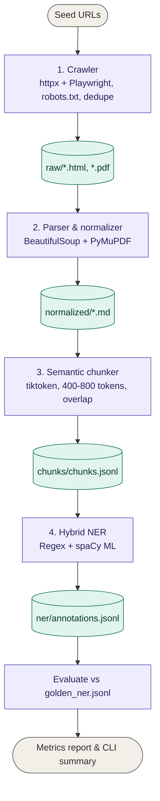

# Mini Legal Data Pipeline

An end-to-end data processing pipeline designed to crawl web sources (static and JS-rendered HTML, PDFs), normalize content into clean Markdown, perform semantic token chunking, and execute a hybrid Named-Entity Recognition (NER) system to extract statutory legal entities.

---

## Pipeline Architecture



---

## Overview & Objectives

This project fulfills the take-home assessment requirements for building a mini data pipeline. It handles unstructured legal data across four core stages:

1. **Crawler** — Ingests seed URLs respecting `robots.txt`, applying exponential backoffs, deduplicating links, and limiting crawl depth to 3 levels.
2. **Parsing & Normalization** — Strips HTML boilerplate and extracts PDF text with page markers, saving clean Markdown files.
3. **Semantic Chunking** — Segments text on semantic boundaries targeting 400–800 tokens per chunk with a 50–100 token overlap.
4. **Named-Entity Recognition (NER)** — Runs a hybrid rule-based and machine learning system to extract entities (`ACT_NAME`, `NOTIFICATION`, `SECTION_REF`, `DATE`, `MONEY`, `ORG`) and evaluates performance against a gold standard dataset (`golden_ner.jsonl`).

---

## Folder Structure & Overview

```
project/
├── chunker/
│   └── chunker.py
├── crawler/
│   └── crawler.py
├── data/
│   ├── golden_ner.jsonl
│   └── seed_urls.json
├── ner/
│   ├── README.md
│   ├── annotations.jsonl
│   ├── evaluate.py
│   └── ner_system.py
├── parsers/
│   └── parser.py
├── scripts/
│   └── generate_report.py
├── tests/
├── .dockerignore
├── .gitignore
├── Dockerfile
├── main.py
├── requirements.txt
└── run.sh
```

---

## Setup & Installation

### Prerequisites

- Python 3.10 or higher
- Docker (Optional, for containerized execution)

### Option 1: Automated Local Setup (Recommended)

Run the automated shell script to set up dependencies, download spaCy models, and configure browser drivers:

```bash
chmod +x run.sh
./run.sh
```

### Option 2: Manual Local Setup

```bash
# 1. Create and activate virtual environment
python3 -m venv venv
